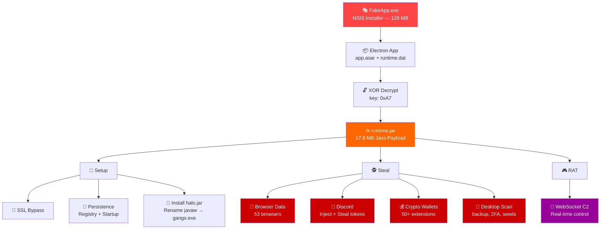

<div align="center">

# 🛡️ Supreme Stealer — Exposed

### Fully Deobfuscated Source Code of a Dangerous Info-Stealer + RAT

[](.)
[](.)
[](.)
[](.)


> *This repository contains the fully reverse-engineered source code of **Supreme Stealer**.*
> *Published for security research, threat intelligence, and public awareness.*
> *No malware was executed during this analysis — pure static reverse engineering.*

</div>

---

## 🔍 What is Supreme Stealer?

Supreme Stealer is a commercial **info-stealer + RAT** (Remote Access Trojan) sold on **Telegram** (`t.me/supremest`). It is distributed as fake applications and performs the following:

<table>
<tr>
<td width="50%">

### 🕵️ Stealer Capabilities
| | Target |
|---|---|
| 🔑 | **Saved passwords** from 53 browsers |
| 🍪 | **Cookies** — session hijacking |
| 💳 | **Credit cards** stored in browsers |
| 💬 | **Discord tokens** from 30+ sources |
| 💰 | **Crypto wallets** — 50+ extensions |
| 📁 | **Recovery files** — backup, 2FA, seeds |
| 📋 | **Autofill, bookmarks, history** |
| 🖥️ | **System info** — OS, CPU, processes |

</td>
<td width="50%">

### 🎮 RAT Capabilities
| | Command |
|---|---|
| ⌨️ | **Remote CMD** execution |
| 📺 | **Live screen** streaming |
| 📸 | **Screenshot** capture |
| 💬 | **Chat** with victim |
| 🔒 | **Lock** keyboard & mouse |
| 🚪 | **Discord logout** — force |
| 🔄 | **Relog** — restart malware |
| ⛔ | **Shutdown** victim's PC |

</td>
</tr>
</table>

---

## ⚡ Attack Flow



---

## 📂 Repository Structure

```
Supreme-Stealer/
│
├── 📄 README.md
│
├── 🌐 electron/                          Electron dropper (JavaScript)
│   ├── main.js                            Deobfuscated — C2 URL & license key exposed
│   ├── main_original.js                   Original with XOR-encoded strings
│   └── package.json
│
├── 💉 discord_injection/
│   └── payload.js                         10KB JS injected into Discord client
│                                          Captures: tokens, passwords, 2FA, credit cards
│
├── ☕ java/
│   │
│   ├── 🎮 rat/                            RAT & C2 Communication
│   │   ├── Main.java                      Entry point — persistence, C2 connect
│   │   ├── RatController.java             WebSocket C2 handler (1131 lines)
│   │   ├── DataCollector.java             Orchestrates data theft & exfiltration
│   │   └── HaloInstaller.java             Installs persistence JAR + bundled JRE
│   │
│   ├── 🕵️ stealer/
│   │   │
│   │   ├── 🌐 browser/                   Browser Data Theft (20 files)
│   │   │   ├── PasswordStealer.java        Login Data → usernames & passwords
│   │   │   ├── CookieStealer.java          Cookies → session tokens
│   │   │   ├── CreditCardStealer.java      Web Data → card numbers
│   │   │   ├── AutofillStealer.java        Autofill → addresses, phones
│   │   │   ├── BookmarkStealer.java        Bookmarks
│   │   │   ├── HistoryStealer.java         Browsing history
│   │   │   ├── DownloadStealer.java        Download history
│   │   │   ├── BrowserProfile.java         Discovers 53 browser profiles
│   │   │   └── DatabaseUtils.java          SQLite DB copy & decryption
│   │   │
│   │   ├── 💬 discord/                    Discord Modules (13 files)
│   │   │   ├── DiscordInjector.java        Kills Discord → patches index.js → restarts
│   │   │   ├── TokenStealer.java           Extracts tokens from 30+ sources
│   │   │   ├── DiscordProfileCollector.java Profile, friends, guilds, badges
│   │   │   ├── EventHandler.java           Real-time: login, 2FA, credit card capture
│   │   │   ├── EmbedBuilder.java           Formats stolen data as Discord embeds
│   │   │   └── WebhookFormatter.java       Sends data via webhooks
│   │   │
│   │   └── 💰 wallet/                    Crypto Wallet Theft (6 files)
│   │       ├── WalletStealer.java          Browser extensions + desktop wallets
│   │       ├── DesktopFileScanner.java      Scans for backup/recovery/2FA files
│   │       └── MasterCollector.java         Aggregates all stolen data into ZIP
│   │
│   ├── 🔐 crypto/                        Encryption Bypass (9 files)
│   │   ├── CryptoDecryptor.java            AES-GCM + DPAPI master key extraction
│   │   ├── AbeProcessInjector.java         Chrome v20 App-Bound Encryption bypass
│   │   │                                   (VirtualAllocEx → WriteProcessMemory
│   │   │                                    → CreateRemoteThread → IElevator COM)
│   │   ├── LockedFileBypass.java           Reads locked DBs via DuplicateHandle
│   │   ├── PeParser.java                  PE32+ export table parser
│   │   └── DpapiWrapper.java              Windows DPAPI wrapper
│   │
│   ├── ⚙️ config/                        Configuration (9 files)
│   │   ├── StringConstants.java            All 58 XOR-decoded string constants
│   │   ├── WebhookConfig.java              Webhook URL, bot name "Supreme"
│   │   └── DiscordApiConstants.java        API endpoints, CDN, timeouts
│   │
│   ├── 💻 system/                        System Information (3 files)
│   │   ├── HwidGenerator.java              Hardware ID via WMI/registry
│   │   └── SystemInfo.java                 OS, CPU, RAM, processes, programs
│   │
│   └── 🔧 util/                          Utilities (7 files)
│       ├── WebhookClient.java              Discord webhook HTTP client
│       ├── SslBypass.java                  Disables all SSL cert validation
│       └── Log.java                        agent.log file writer
│
└── 🖼️ installer/
    └── icon.ico                            NSIS installer icon
```

---

## 🚨 Indicators of Compromise (IOC)

<details>
<summary><b>🌐 Network IOCs</b></summary>

| Type | Value |
|---|---|
| C2 Server | `http://veled.com.tr` |
| License Key | `H95S2-MJ56T-LJPQ2-ATZ6Z` |
| Webhook Bot | `Supreme` |
| Webhook Avatar | `https://i.imgur.com/YYumsB0.png` |
| Telegram | `t.me/supremest` |
| API Endpoints | `/v1/poll`, `/v1/screen_upload`, `/v1/stream`, `/v1/chat` |

</details>

<details>
<summary><b>📁 Filesystem IOCs</b></summary>

| Type | Value |
|---|---|
| Persistence JAR | `%LOCALAPPDATA%\halos\halo.jar` |
| Renamed JRE | `%LOCALAPPDATA%\halos\jdk\bin\gangs.exe` |
| Lock file | `%TEMP%\.sp_lock` |
| Init marker | `%TEMP%\.ira_init` |
| Temp payload | `%TEMP%\sp_*.jar` |
| Log file | `%LOCALAPPDATA%\halos\agent.log` |

</details>

<details>
<summary><b>🔑 Registry IOCs</b></summary>

| Type | Value |
|---|---|
| Startup | `HKCU\Software\Microsoft\Windows\CurrentVersion\Run\halos` |

</details>

<details>
<summary><b>💬 Discord IOCs</b></summary>

| Type | Value |
|---|---|
| Injection marker | `/* __SP_INJECTED__ */` |
| Blocked WebSocket | `wss://remote-auth-gateway.discord.gg` |
| Targeted clients | Discord, DiscordCanary, DiscordPTB, DiscordDevelopment |

</details>

---

## 🎯 Targeted Software

<details>
<summary><b>🌐 53 Browsers</b></summary>

Chrome, Chrome Beta, Chrome Dev, Chrome Canary, Chromium, Edge, Edge Beta, Edge Dev, Edge Canary, Brave, Brave Beta, Brave Nightly, Opera, Opera GX, Vivaldi, Yandex, CocCoc, Comodo Dragon, Epic Privacy, Iridium, Iron, Maxthon, Orbitum, QQ Browser, Sleipnir, Slimjet, Sputnik, Torch, UC Browser, Chedot, CentBrowser, 7Star, Amigo, Elements, Kometa, Firefox, Waterfox, Pale Moon, Librewolf, and more.

</details>

<details>
<summary><b>💰 50+ Crypto Wallets</b></summary>

**Browser Extensions:** MetaMask, Phantom, Exodus, Coinbase Wallet, Trust Wallet, Brave Wallet, Ronin, TronLink, Solflare, Slope, Keplr, Terra Station, Coin98, BitPay, Guarda, Math Wallet, SafePal, XDEFI, Rabby, Backpack, OKX Wallet, and more.

**Desktop Wallets:** Exodus, Atomic, Electrum, Wasabi, Bitcoin Core, Ethereum Wallet, and more.

</details>

---

## 🧹 Removal Instructions

<details>
<summary><b>Click to expand removal steps</b></summary>

```powershell
# ====== STEP 1: Remove persistence ======
reg delete "HKCU\Software\Microsoft\Windows\CurrentVersion\Run" /v "halos" /f

# ====== STEP 2: Delete malware files ======
Remove-Item "$env:LOCALAPPDATA\halos" -Recurse -Force
Remove-Item "$env:TEMP\.sp_lock" -Force -ErrorAction SilentlyContinue
Remove-Item "$env:TEMP\.ira_init" -Force -ErrorAction SilentlyContinue
Remove-Item "$env:TEMP\sp_*.jar" -Force -ErrorAction SilentlyContinue

# ====== STEP 3: Fix Discord injection ======
# For each Discord installation, navigate to:
#   %APPDATA%\discord\<version>\modules\discord_desktop_core\
# Replace index.js with:
#   module.exports = require('./core.asar');

# ====== STEP 4: Post-infection actions ======
# ⚠️ Change ALL passwords saved in browsers
# ⚠️ Change Discord password and reset 2FA
# ⚠️ Revoke and regenerate crypto wallet seed phrases
# ⚠️ Contact your bank if credit cards were stored in browsers
# ⚠️ Enable 2FA on all accounts
```

</details>

---

## 🔬 Technical Details

<details>
<summary><b>Encryption & Obfuscation</b></summary>

| Layer | Technique |
|---|---|
| Payload encryption | XOR with single byte key `0xA7` (167) |
| String obfuscation | Per-string XOR with varying int keys |
| Name obfuscation | Single-letter classes, methods, fields |
| Browser passwords | AES-256-GCM with DPAPI-protected master key |
| Chrome v20 ABE | Process injection + IElevator COM interface |
| Locked DB bypass | `NtQuerySystemInformation` + `DuplicateHandle` |

</details>

<details>
<summary><b>Architecture</b></summary>

| Stage | Technology |
|---|---|
| Installer | NSIS (128 MB) |
| Dropper | Electron 28.3.3 (JavaScript) |
| Payload delivery | XOR 0xA7 encrypted JAR |
| Core malware | Java 21 (stealer + RAT) |
| Discord injection | JavaScript (10KB payload) |
| ABE bypass | x64 native shellcode (PE) |
| C2 protocol | HTTP polling + WebSocket |
| Exfiltration | Multi-part HTTP POST to C2 |
| Persistence | Registry Run key + scheduled JAR |

</details>

<details>
<summary><b>Deobfuscation Process</b></summary>

1. **NSIS extraction** → 7-Zip unpacking → Electron app isolation
2. **Asar extraction** → main.js XOR string decryption
3. **XOR 0xA7 decryption** → runtime.dat → valid JAR file
4. **CFR 0.152 decompilation** — 2 errors vs JADX's 1,781
5. **XOR 0xA7 decryption** → abe/core.dat → x64 shellcode PE
6. **6-pass symbol renaming** — 400+ methods, fields, files
7. **213 inline string constant decoding** with original comments
8. **Discord injection extraction** — 10KB standalone JS file
9. **Cross-reference updating** — package-level call resolution

</details>

---

## 📊 Deobfuscation Score

```
╔══════════════════════════════════════════════╗
║           DEOBFUSCATION RESULTS              ║
╠══════════════════════════════════════════════╣
║  File names      ████████████████████  100%  ║
║  Methods         ████████████████████   99%  ║
║  Strings         ████████████████████  100%  ║
║  Fields          ████████████████░░░░   83%  ║
║  Binaries        ████████████████████  100%  ║
║  Discord JS      ████████████████████  100%  ║
╠══════════════════════════════════════════════╣
║  OVERALL         ███████████████████░   95%  ║
╚══════════════════════════════════════════════╝
```

---

## ⚖️ Disclaimer

This repository is published for **educational and security research purposes only**. The code is provided to help security researchers, antivirus vendors, and the general public understand how this malware operates.

**Do not use this code for malicious purposes.**

If you are a victim, follow the [removal instructions](#-removal-instructions) and report the C2 infrastructure to your local CERT or law enforcement.

---

## 🛠️ Tools Used

| Tool | Purpose |
|---|---|
| [CFR](https://benf.org/other/cfr/) v0.152 | Java decompilation |
| [7-Zip](https://7-zip.org/) | NSIS/archive extraction |
| [Node.js](https://nodejs.org/) | Asar extraction & scripting |
| Static analysis only | **No malware was executed** |

---

<div align="center">

**If this helped you, ⭐ star the repo to increase visibility and protect more people.**

*Reverse engineered with patience and caffeine ☕*

</div>
